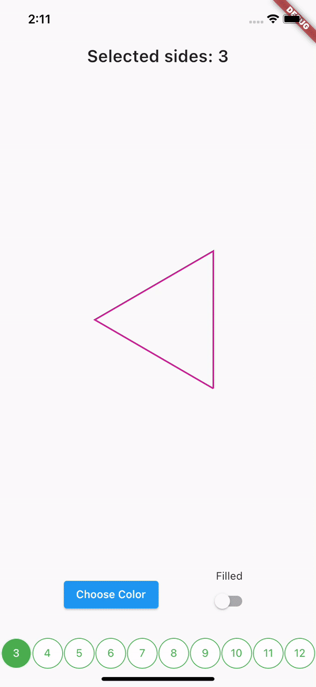

# Polygon Animation

In this animation, we are changing the sides of a Polygon ranging from 3 to 12.  
While changing the sides, it is rotating on its own axis, and also animating trough different sizes between the values. 
Once can choose if the polygon should be filled or just outlined with variations of [colors](https://pub.dev/packages/flutter_colorpicker).  
Furthermore, in animation nothing explains more than a demonstration. So here it is, 

